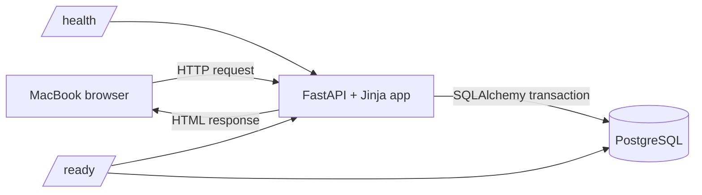

# SCS323 Address Book Learning App

Version 1.0.0 is a small FastAPI, Jinja, PostgreSQL, Alembic, and Docker Compose application for tracing a real server-rendered request path. It is an instructional example, not a submission and not a production-ready identity system.

Start with [QUICKSTART.md](QUICKSTART.md), then follow [WALKTHROUGH.md](WALKTHROUGH.md).

## Architecture

The browser-facing app is published to MacBook loopback. PostgreSQL stays on the private Compose network and persists in the named `address_book_data` volume.

## 3NF teaching model

`contacts` contains facts that occur once per contact: name, one required primary email, and creation time. `addresses` and `phone_numbers` are separate because a contact can have zero, one, or many of each. Repeating `home_street`, `work_street`, `phone_1`, and `phone_2` columns in `contacts` would create empty columns, artificial limits, duplicated rules, and update anomalies.

Email remains in `contacts` because v1 has exactly one required primary email. If requirements later allow multiple labeled emails, create a reviewed `email_addresses` table rather than adding `email_2` and `email_3` columns.

## Version contract

The app version appears in the footer, FastAPI metadata, `/health`, `/ready`, logs, `pyproject.toml`, and this README. Increment them together for a real release.
